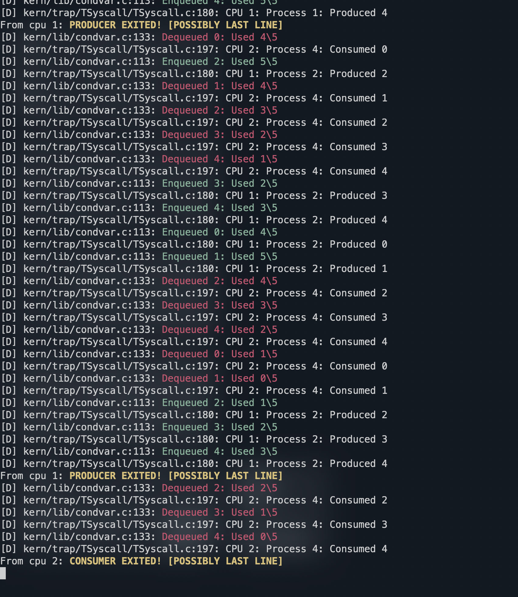

<!-- Compile: make / make all
Run tests: make clean && make TEST=1
Run in qemu: make qemu / make qemu-nox
Debug with gdb: make qemu-gdb / make qemu-nox-gdb
                (in another terminal) gdb -->

<!-- List here the following info:
1. who you have worked with
2. whether you coded this assignment together, and if not, who worked on which part
3. brief description of what you have implemented
4. and anything else you would like us to know -->

# Lab 5: File Systems

In this lab, we add the file system support to mCertiKOS. We have already implemented an IDE disk driver and some parts of the file system to stast with. We will extend the mCertiKOS scheduler with the ability to make threads sleep and wake threads up; this is necessary for the implementation of a more efficient file system. Then we are asked to implement various parts of the file system across multiple abstraction layers.

## Team: Anton Melnychuk and Oliver Li

### Workload Distribution

| Name           | Tasks                                                          |
|----------------|----------------------------------------------------------------|
| Anton Melnychuk| - Read Chapter 6 [xv6 book] (Exercise 1)                       |
| Anton Melnychuk| - Part 2                                                       |
| Anton Melnychuk| - Part 3                                                       |
| Anton Melnychuk| - Part 4                                                       |
| Anton Melnychuk| - README                                                         |
| Oliver Li      | - Read Chapter 6 [xv6 book] (Exercise 1)                       |
| Oliver Li      | - Part 1                                                       |
| Oliver Li      | - Part 2                                                       |
| Oliver Li      | - Part 3                                                       |
| Oliver Li      | - Part 4                                                       |

### 🛠How to Run

This assignment is organized into four parts, each located in a separate branch: `lab5part1`, `lab5part2`, `lab5part3`, and `lab5part4`. To view the implementation of a specific part, please switch to the corresponding branch.

To see the output of the final part, run:

```sh
make && make qemu-nox
```

Refer to the screenshot below for the expected output (Part 3). Run the latest solution to see test the SHELL implementation.



## Additional Readline Fixes

The provided `readline` system call had several issues. First, it failed to handle cases where pressing backspace would overwrite the `$>` prompt, causing command parsing to fail if the user accidentally backspaced on an empty input. Second, backspace did not visually remove characters as expected. A correct backspace implementation should move the cursor left, overwrite the character with a space, and move the cursor left again to maintain proper visual feedback. Therefore, we provided the next chnages:

```
char *readline(const char *prompt)
{
    int i;
    char c;

    if (prompt != NULL)
        dprintf("%s", prompt);

    i = 0;
    while (1) {
        c = getchar();
        if (c < 0) {
            dprintf("read error: %e\n", c);
            return NULL;
        } else if ((c == '\b' || c == '\x7f')) {
            // BUG FIXED
            if (i > 0) {
                i--;
                // BUG FIXED
                putchar('\b');    // move back
                putchar(' ');     // overwrite with space
                putchar('\b');    // move back again
            }
        } else if (c >= ' ' && i < BUFLEN - 1) {
            putchar(c);
            linebuf[i++] = c;
        } else if (c == '\n' || c == '\r') {
            putchar('\n');
            linebuf[i] = 0;
            return linebuf;
        }
    }
}
```

## Shell Command Summary

Each shell command is documented below with its usage and behavior.

### Directory & Path Commands

- **`ls [path]`**  
  Lists files in a directory or prints the file name if it's a regular file.  
  • `ls` → list current directory  
  • `ls dir1` → list contents of `dir1`

- **`pwd`**  
  Prints the current working directory.  
  • `pwd`

- **`cd <dir>`**  
  Changes the current working directory.  
  • `cd /` → go to root  
  • `cd dir1` → enter `dir1`

---

### File & Directory Management

- **`mkdir <name>...`**  
  Creates one or more directories.  
  • `mkdir test`  
  • `mkdir foo bar`

- **`touch <file>...`**  
  Creates one or more empty files (or updates their timestamps).  
  • `touch file1`  
  • `touch file1 file2`

- **`rm <target>...`**  
  Removes files or directories recursively.  
  • `rm file.txt`  
  • `rm dir1`

- **`cp <src> <dst>`**  
  Copies file content from `src` to `dst`.  
  • `cp file1 copy1`

- **`mv <src> <dst>`**  
  Moves/renames a file (currently stubbed).  
  • `mv old.txt new.txt`

---

### File Content Operations

- **`cat <file>...`**  
  Prints the content of files to the console.  
  • `cat file1`  
  • `cat file1 file2`

- **`write <data> <file>`**  
  Overwrites `file` with `data`, replacing all existing content.  
  • `write 123 file.txt`

- **`append <data> <file>`**  
  Appends `data` to the end of `file`.  
  • `append abc file.txt`

